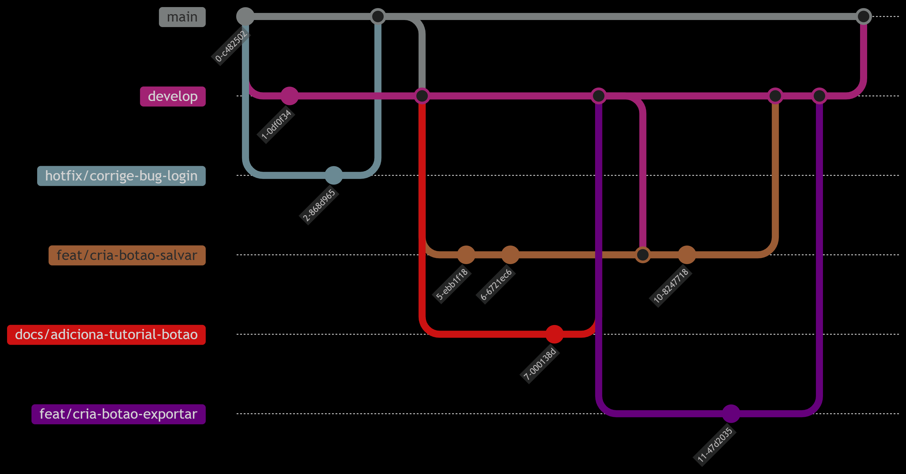

<Table>
  <tr>
   <td><a></td>
    <td>
      
    </td>
  </tr>
</table>

# Nome do Projeto: Radar Inteli

## Nome do Grupo: <nome do grupo>

## Integrantes:

- <a href="https://www.linkedin.com/in/karine-victoria/">Karine Paixão</a>
- <a href="https://www.linkedin.com/in/vanunes/">Vanessa Nunes</a>

# Sumário

- [1. Introdução](#1-introdução)
  - [1.1 Objetivo do Documento](#11-objetivo-do-documento)
- [2. Política de Branches](#2-política-de-branches)
  - [2.1 Visão Geral do Gitflow](#21-visão-geral-do-gitflow)
  - [2.2 Estrutura de Branches](#22-estrutura-de-branches)
  - [2.3 Diretrizes de Uso das Branches](#23-diretrizes-de-uso-das-branches)
    - [2.3.1 Criação de Branches](#231-criação-de-branches)
    - [2.3.2 Regras de Merge e Exclusão](#232-regras-de-merge-e-exclusão)
    - [2.3.3 Regras](#233-regras)
    - [2.3.4 Boas Práticas](#234-boas-práticas)
    - [2.3.5 Regras para Proteção de Branches](#235-regras-para-proteção-de-branches)
- [3. Políticas de Commit](#3-políticas-de-commit)
- [4. Política de Push e Pull Requests](#4-política-de-push-e-pull-requests)
- [5. Gestão de Arquivos Sensíveis](#5-gestao-de-arquivos-sensíveis)
- [6. Política de Rollback](#6-política-de-rollback)
- [7. Registro de Variáveis de Ambiente](#7-registro-de-variáveis-de-ambiente) 
- [Referências](#referências)

# 1. Introdução
&nbsp;&nbsp;&nbsp;&nbsp;Este documento estabelece diretrizes claras para o gerenciamento de versionamento, com o objetivo de adotar boas práticas no desenvolvimento de software, visando organização, qualidade do código, fluxo de desenvolvimento e colaboração da equipe. Todos os membros da equipe devem seguir as instruções definidas neste documento.

## 1.1 Objetivo do Documento
&nbsp;&nbsp;&nbsp;&nbsp;Este documento estabelece diretrizes claras para a utilização de boas práticas no desenvolvimento de software, visando a organização e a qualidade do código. Todos os membros da equipe devem seguir as instruções definidas.

# 2. Política de Branches
&nbsp;&nbsp;&nbsp;&nbsp;Esta seção estabelece como será o uso do GitFlow no desenvolvimento do projeto, descrevendo a nomenclatura e funções das branches com os seus devidos usos e padrões.

## 2.1 Visão Geral do Gitflow
&nbsp;&nbsp;&nbsp;&nbsp; O **GitFlow** é um modelo de branching amplamente utilizado para estruturar o fluxo de desenvolvimento em projetos baseados em Git. Ele define uma organização clara das branches, separando o código em desenvolvimento (`develop`) do código de produção (`main`), além de permitir a criação de branches específicas para novas funcionalidades (`feature`), correções (`hotfix`), releases (`release`) e docs (`docs`). Essa abordagem melhora a colaboração da equipe, facilita a integração contínua e garante um ciclo de desenvolvimento mais organizado e previsível.

&nbsp;&nbsp;&nbsp;&nbsp;O diagrama abaixo ilustra o fluxo completo de trabalho adotado, mostrando a interação entre as diferentes branches ao longo do ciclo de desenvolvimento, desde a criação de features até a publicação em produção, seguindo os padrões estabelecidos de merge e versionamento. Para detalhes sobre as funções de cada tipo de branch, consulte a seção [2.2](#22-estrutura-de-branches) desta documentação.

Figura X - Diagrama de fluxo de workflow 
 
Fonte: Material produzido pelos autores (2025)

## 2.2 Estrutura de Branches
&nbsp;&nbsp;&nbsp;&nbsp; Padrão de Nomenclatura das Branches que serão adotadas no projeto:

- **main**: Contém o código estável e pronto para produção. Somente código testado e aprovado deve ser mergeado aqui.
- **develop**: Branch de integração contínua, onde todas as novas funcionalidades e correções são mescladas antes de serem liberadas para produção.
- **feat/[nome-da-feature]**: Utilizada para o desenvolvimento de novas funcionalidades. Exemplo: `feat/integracao-api.`
- **fix/[nome-do-bug]**: Utilizada para correção de bugs. Exemplo: `fix/corrige-login.`
- **hotfix/[nome-do-hotfix]**: Utilizada para correções urgentes diretamente na produção. Exemplo: `hotfix/corrige-bug-em-producao.`
- **docs/[nome-da-documentação]**: Utilizada para documentação de alguma parte do projeto nos arquivos .md. Exemplo: `docs/adiciona-introdução`
- **release/[versao]**: Utilizada para preparar uma nova versão do software. Exemplo: `release/v1.0.0.`
 

## 2.3 Diretrizes de Uso das Branches
### 2.3.1 Criação de Branches
&nbsp;&nbsp;&nbsp;&nbsp; Para garantir um fluxo de desenvolvimento organizado e previsível, adotamos o modelo de versionamento GitFlow, que define a estrutura principal do repositório com as branches `main` e `develop`, além de `branches específicas` para cada tarefa, como `docs/task-1` ou `feat/task-2` . Esse modelo permite um ciclo de desenvolvimento bem estruturado e facilita a contribuição e o gerenciamento de entregas. Também seguimos o padrão de *Conventional Commits* para padronizar as mensagens de commit, o que garante maior organizaçõa e rastreabilidade das alterações no código. O fluxo de trabalho deve ser seguido rigorosamente para manter a consistência e a qualidade do desenvolvimento ao longo do projeto.

  - Funcionalidades (Features) Devem ser criadas a partir da branch `develop`
  - Qualquer atualização de documentação deve ser feita em uma branch separada, criada a partir da `develop`
  - Hotfixes Devem ser criadas diretamente da branch `main` para correções críticas em produção

### 2.3.2 Regras de Merge e Exclusão
1. Todas as branches:
   - Devem ser mescladas na `develop` via Pull Request (PR) após aprovação de um membro da dupla que não tenha realizado o PR
   - A branch deve ser somente excluída ao final da sprint

2. **Hotfix**:
   - Devem ser mescladas diretamente na `main` via Pull Request (PR) após aprovação de um membro da dupla que não tenha realizado o PR
   - Após o merge na `main`:
     - A `main` deve ser mesclada na `develop` para sincronizar as correções

### 2.3.3 Regras
- **Commits diretos são proibidos** nas branches:
  - `main` (produção)
  - `develop` (integração)

### 2.3.4 Boas Práticas
- Use nomes descritivos nas branches (ex: `feature/autenticacao-google`)
- Mantenha branches atualizadas com a `develop` durante o desenvolvimento

### 2.3.5 Regras para Proteção de Branches

&nbsp;&nbsp;&nbsp;&nbsp; Com o objetivo de garantir a integridade do código e manter a qualidade das entregas, adotamos regras específicas de proteção para as principais branches do projeto.

&nbsp; As regras de proteção aplicadas são:

- **Branch Protegida**: A branch principal (`main` ou `develop`) é protegida contra commits diretos. Todas as alterações devem ser feitas via Pull Request (PR).
- **Obrigatoriedade de Pull Request**: Toda alteração de código deve ser submetida através de um Pull Request, garantindo rastreabilidade e revisão por outros membros do time.
- **Revisão Obrigatória**: Um Pull Request só pode ser mesclado após a aprovação de pelo menos um revisor designado.

Estas medidas visam melhorar a colaboração entre os membros, manter o histórico de alterações limpo e seguro, e minimizar o risco de erros no ambiente principal do projeto.

# 3. Políticas de Commit
Integrar "Conventional Commits" nas políticas de commit ajuda a manter um histórico de commits claro e estruturado, facilitando a automação de processos como geração de changelogs e versionamento semântico.

As mensagens de commit devem seguir o padrão de Conventional Commits para garantir clareza e consistência.

Formato: [Tipo][Escopo opcional]: Mensagem clara e descritiva.

Os tipos devem ser:

- **feat**: Uma nova funcionalidade para o usuário.
- **fix**: Correção de bug.
- **docs**: Mudanças na documentação.
- **style**: Mudanças que não afetam o significado do código (espaços em branco, formatação, etc.).
- **refactor**: Uma mudança de código que não corrige um bug nem adiciona uma funcionalidade.
- **test**: Adição ou correção de testes.
- **chore**: Atualizações de tarefas de build ou ferramentas auxiliares e bibliotecas, como a geração de documentação.

Exemplo de commit: `feat(auth): adiciona autenticação via JWT`

Proibido:
- O uso de emojis nas mensagens de commit, e commits com mensagens vagas como "melhorias" ou "atualizações".

# 4. Política de Push e Pull Requests

**Políticas de Push**:
- Não é permitido fazer push diretamente para a main ou develop.
- Todas as contribuições devem ser feitas via branches e submetidas por meio de pull requests.

**Regras de Push**:
- Todo código deve passar por revisão de código por pares antes de ser mergeado.

**Revisão por Pares - Critério de Aprovação**:
- O pull request deve ser revisado por uma pessoa.
- A revisão de código deve considerar: 
  - Está funcional e resolve o problema proposto.
  - Passou em todos os testes automatizados.
  - Verificação de boas práticas de código.
  - Não introduz duplicidade de código.
- Após a aprovação, a branch deve ser mergeada na develop e o pull request pode ser fechado. 

## 5. Gestão de Arquivos Sensíveis
- É obrigatório o uso de .gitignore bem configurado para bloquear:
  - Arquivos contendo senhas, segredos ou informações sensíveis.
  - Arquivos de configuração individuais (por exemplo, .env, configs locais, etc).
- Explicação/documentação das diferenças entre arquivos de configuração locais, de desenvolvimento e de produção (ex.: .env.local, .env.dev, .env.prod).
- Nunca commitar dados sensíveis ou credenciais diretamente no repositório.

## 6. Política de Rollback
- Documentar o processo básico para rollback de uma release defeituosa.
- Passos mínimos recomendados:
  - Identificar rapidamente a versão estável anterior (tag/release/commit).
  - Criar uma branch/selecione a tag da versão a ser restaurada.
  - Realizar o deploy dessa versão, conforme procedimento do time.
  - Comunicar o time e stakeholders sobre a reversão.
- Deixar esses procedimentos registrados no repositório (ex: docs/rollback.md).

## 7. Registro de Variáveis de Ambiente
- Obrigatório manter um arquivo .env.example documentando todas as variáveis de ambiente exigidas pela aplicação.
- O arquivo deve listar todas as keys (sem valores reais/sensíveis) e breve explicação de cada variável.
- Todos os membros devem usar esse exemplo para criar seus próprios arquivos .env locais.
- Exemplo:
  - DB_HOST= # Endereço do banco de dados
  - DB_USER= # Usuário do banco
  - DB_PASS= # Senha do banco (NUNCA commitar no repositório)
  - SECRET_KEY= # Chave secreta do sistema

# Referências
- Conventional Commits: https://www.conventionalcommits.org/en/v1.0.0/
- GitFlow: https://nvie.com/posts/a-successful-git-branching-model/
- Gitihub/iuricode: https://github.com/iuricode/padroes-de-commits
- .dockerignore Reference: https://docs.docker.com/engine/reference/builder/#dockerignore-file
- .gitignore (documentação oficial): https://git-scm.com/docs/gitignore
- gitignore.io (gerador de .gitignore para diferentes stacks): https://www.toptal.com/developers/gitignore/
- Handling secrets in Git repos (GitHub Guide): https://docs.github.com/en/authentication/keeping-your-account-and-data-secure/creating-and-storing-encrypted-secrets
- Creating a pull request template for your repository: https://docs.github.com/en/communities/using-templates-to-encourage-useful-issues-and-pull-requests/creating-a-pull-request-template-for-your-repository
- Exemplo de Checklists para PRs: https://github.com/othneildrew/Best-README-Template#pull-request-template
- Best Practices for Rollbacks (Atlassian): https://www.atlassian.com/continuous-delivery/principles/rollback-strategies
- How to Use Git Revert and Git Reset: https://www.git-tower.com/learn/git/faq/git-reset-vs-revert/
- 12 Factor App: Config: https://12factor.net/config
- Dotenv (Exemplo e uso de arquivos .env): https://github.com/motdotla/dotenv#usage
