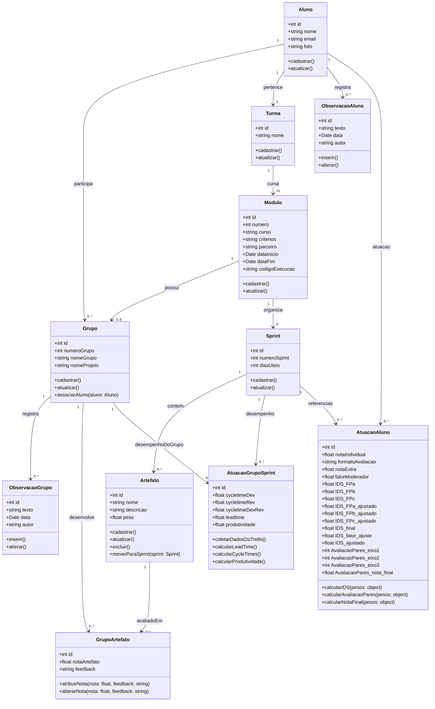
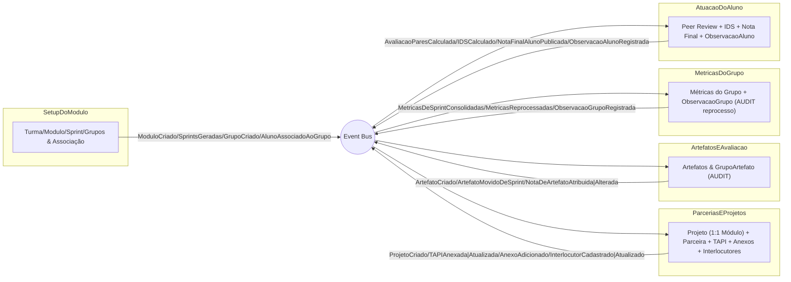

<Table>
  <tr>
    <td><a></td>
    <td>
      
    </td>
  </tr>
</table>

# Nome do Projeto: <nome do projeto>

## Nome do Grupo: <nome do grupo>

## Integrantes:

- <a href="https://www.linkedin.com/in/username/">Karine</a>
- <a href="https://www.linkedin.com/in/username/">Vanessa</a>
- <a href="https://www.linkedin.com/in/username/">Afonso</a>
- <a href="https://www.linkedin.com/in/username/">Reginaldo</a>

# Sumário

- [1. Introdução](#1-introdução)
  - [1.1 Termos e Abreviações](#11-termos-e-abreviações)
- [2. Entendimento do Projeto e do Negócio](#2-entendimento-do-projeto-e-do-negócio)
  - [2.1 Problema](#21-problema)
  - [2.2 Visão do Projeto e do Produto](#22-visão-do-projeto-e-do-produto)
  - [2.3 Personas e Jornada do Usuário](#23-personas-e-jornada-do-usuário)
  - [2.4 Modelagem do Fluxo de Negócio](#24-modelagem-do-fluxo-de-negócio)
  - [2.5 Matriz de Risco do Projeto](#25-matriz-de-risco-do-projeto)
  - [2.6 Ideação - Brainstorming de features](#26-ideação---brainstorming-de-features)
  - [2.7 Métricas de Avaliação](#27-metricas-de-avaliação)
- [3. Requisitos do Projeto](#3-requisitos-do-projeto)
  - [3.1 Requisitos Funcionais (RFs)](#31-requisitos-funcionais-rfs)
  - [3.2 Requisitos Não Funcionais (RNFs)](#32-requisitos-não-funcionais-rnfs)
  - [3.3 Correlação RFs e RNFs](#33-correlação-rfs-e-rnfs)
- [4. Modelagem de Dados](#4-modelagem-de-dados)
  - [4.1 Modelo Conceitual de Dados](#41-modelo-conceitual-de-dados)
  - [4.2 Modelo Lógico de Dados](#42-modelo-lógico-de-dados)
  - [4.3 Modelo Físico de Dados](#43-modelo-físico-de-dados)
- [5. Solução Técnica (Design)](#5-solução-técnica-design)
  - [5.1 Diagrama de Classes da UML](#51-diagrama-de-classes-da-uml)
  - [5.2 Diagrama de Componentes da UML](#52-diagrama-de-componentes-da-uml)
  - [5.3 Diagramas de Sequência da UML](#53-diagramas-de-sequência-da-uml)
- [6. Mapeamento Técnico de Infraestrutura e Implantação](#6-mapeamento-técnico-de-infraestrutura-e-implantação)
  - [6.1 Diagrama de Implantação da UML](#61-diagrama-de-implantação-da-uml)
  - [6.2 Justificativa das Escolhas de Implantação](#62-justificativa-das-escolhas-de-implantação)
  - [6.3 Considerações sobre Desempenho e Segurança](#63-considerações-sobre-desempenho-e-segurança)
- [7. Projeto Visual da Solução](#7-projeto-visual-da-solução)
  - [7.1 Desenvolvimento de Wireframes](#71-desenvolvimento-de-wireframes)
  - [7.2 Desenvolvimento de Mockups](#72-desenvolvimento-de-mockups)
  - [7.3 Guia Visual](#73-guia-visual)
- [8. Desenvolvimento do Projeto](#8-desenvolvimento-do-projeto)
  - [8.1 Arquitetura de Codificação e Estrutura de Diretórios](#81-arquitetura-de-codificação-e-estrutura-de-diretórios)
  - [8.2 Desenvolvimento de Features](#82-desenvolvimento-de-features)
    - [8.2.1 Sprint 3](#821-sprint-3)
    - [8.2.2 Sprint 4](#822-sprint-4)
    - [8.2.3 Sprint 5](#823-sprint-5)
  - [8.3 Testes Unitários e de Integração](#83-testes-unitários-e-de-integração)
  - [8.4 Documentações automáticas](#84-documentações-automáticas)
- [9. Planejamento e Execução de Testes](#9-planejamento-e-execução-de-testes)
  - [9.1 Testes Funcionais](#91-testes-funcionais)
    - [9.1.1 Planejamento](#911-planejamento)
    - [9.1.2 Resultados](#912-resultados)
  - [9.2 Testes de RNFs](#92-testes-de-rnfs)
    - [9.2.1 Planejamento](#921-planejamento)
    - [9.2.2 Resultados](#922-resultados)
  - [9.3 Testes de Usabilidade](#93-testes-de-usabilidade)
    - [9.3.1 Planejamento](#931-planejamento)
    - [9.3.2 Resultados](#932-resultados)
- [10. Procedimentos de Implantação](#10-procedimentos-de-implantação)
  - [10.1 Implantação e Configuração do Banco de Dados](#101-implantação-e-configuração-do-banco-de-dados)
  - [10.2 Implantação do Protótipo para uso por equipe de desenvolvimento](#102-implantação-do-protótipo-para-uso-por-equipe-de-desenvolvimento)
- [Referências](#referências)

# 1. Introdução
O Radar Inteli é uma solução desenvolvida para facilitar o acompanhamento, análise e registro do desempenho dos alunos nos módulos do Inteli. O sistema busca integrar dados de diferentes fontes, automatizar cálculos de produtividade e notas, além de centralizar informações relevantes para professores orientadores e coordenadores. Dessa forma, o Radar Inteli contribui para uma gestão acadêmica mais eficiente, reduzindo erros e otimizando o processo de avaliação.

## 1.1 Termos e Abreviações
- 

# 2. Entendimento do Projeto e do Negócio
Esta seção apresenta o problema e a proposta de solução.

## 2.1 Problema
Um professor orientador, registra e analisa informações quantitativas e qualitativas para acompanhamento dos alunos duarante o desenvolvimento dos módulos sob sua responsabilidade. Atualmente todas as informações são registradas manualmente em planilhas eletrônicas e as análises são criadas através de opções de geração de estatísticas oferecidas por essas ferramentas. A coleta de várias dessas informações advém de outros sistemas que demandam cópias manuais de uma grande quantidade de informações,resultando em alto esforço, risco de erros e diminuição do potencial de uso dessas informações para suporte ao desenvolvimento dos alunos dentro do módulo e no curso.  

## 2.2 Visão do Projeto e do Produto
Abaixo é apresentada a visão geral do produto.

> **FOR**: Professores orientadores do Inteli

> **WHOSE**: que tem dificuldades em acompanhar, avaliar e analisar desempenho dos alunos

> **THE**: Radar Inteli

> **IS A**: Sistema de Informação

> **THAT**: torna o processo de coleta e análise de dados individuais e de grupo mais eficiente e eficaz

> **DIFFERENT FROM**: Planilhas excel e diversos sistemas que não se comunicam entre si

> **OUR PRODUCT**: oferece um sistema unificado para tratamento de dados de desempenho de produtividade e qualitativos dos alunos e respectivos grupos, nos módulos e entre os mesmo.

 

O que este sistema é e o que este sistema não é:

> **IS**: Sistema de tratamento de dados provenientes de outros sistemas criados no Inteli; Um sistema de cálculo de notas e análise de métricas; Sistema que a Profa. Vanessa está usando para realizar a execução dos módulos de ES.

> **IS NOT**: Sistema Acadêmico, Sistema Institucional.

 

**Objetivos do Produto**

- Servir como apoio para o desenvolvimento em práticas de engenharia de software e de desenvolvimento de sistemas.

- Ajudar no processo de coordenação da avaliação de desempenho dos alunos

## 2.3 Personas e Jornada do Usuário
As personas são Professores orientadores, Professores de Eixo (para acompanhamento) e Coordenador.

## 2.4 Modelagem do Fluxo de Negócio
Nesta seção são listadas as atividades que a/o Professor(a) orientador(a) realiza.

- Coleta de índices de agilidade individuais e de grupo a cada Sprint.
- Cálculo de fator de produtividade individual e de grupo.
- Coleta de dados de avaliação de pares e feedbacks dos colegas de grupo para cada aluno.
- Registro de notas por atividades extras com feedbacks.
- Cálculo de nota do aluno na Sprint com feedbacks.
- Cálculo da nota dos artefatos com registro de feedback.
- Cálculo da média das notas dos artefatos.
- Acompanhamento de impressões do time docente sobre cada aluno ao longo do módulo.

## 2.5 Matriz de Risco do Projeto
Segue a lista de riscos possíveis para este projeto
- Falta de tempo para dedicar ao projeto
  - Ação: Definição de prazos reais e factíveis. 
- Dificuldade de desenvolvimento de uma solução simples e eficiente.
  - Ação: Solicitar consultoria do Prof. Afonso para direcionamento e aprovação das propostas

Segue a lista de oportunidades
- Participar ativamente de todas as etapas de construção de um sistema.
- Experimentar os conhecimentos e práticas abordados nos módulos. 

## 2.6 Ideação - Brainstorming de features
Todas as ideias que forem aparecendo serão incluídas nesta seção sem compromisso com entrega.
Esta seção serve como backlog do produto.

- Listagem de alunos, com nome, e-mail e fotos.
- CRUD de Turma, Módulo e Grupo (número)
- Associação de aluno a módulo e Grupo (número e nome)
- Definição de SM e PO para cada sprint
- Definição dos artefatos de cada sprint para um módulo.
- Registro de avaliação de cada artefato
- Cálculo da média dos artefatos de cada grupo em cada Sprint
- Registro de avaliação de pares (Fator Cesar)
- Registro do índice de desempenho na Sprint (Fator Renato)
- Registro de informações/anotações sobre o aluno em relação a Sprint
- Registro de nota extra mérito/demérito
- Registro de nota - fator moderador
- Cálculo de nota individual do aluno na Sprint
- Registro de mensagem opcional do orientador para o aluno
- Criação do texto de feedback para copiar e colar na Adalove 

## 2.7 Métricas de Avaliação
As métricas de avaliação são as seguintes:

- Corretude dos cálculos
- Segurança na persistência dos dados
- Usabilidade no dia a dia do módulo

# 3. Requisitos do Projeto
Os Requisitos funcionais e não funcionais são apresentados a seguir.

## 3.1 Requisitos Funcionais (RFs)
Os requisitos funcionais são apresentados abaixo.

|ID|RF|Descrição|
|---|---|---|
|RF001|Cadastro e alteração de alunos|O sistema deve permitir o cadastro e alteração de informações (nome, email, curso, turma, módulo) sobre alunos do Inteli|
|RF002|Cadastro e alteração de Turma, Módulo e Grupo (número)|O sistema deve permitir o cadastro e alteração de Turmas, módulo e Grupo (número)|
|RF003|Associação de aluno a módulo e Grupo|O sistema deve permitir que o orientador associe alunos a módulos e grupos (número)|
|RF004|Cadastro de artefato de uma Sprint de um módulo|O sistema deve permitir o cadstro de artefatos de sprints de módulos|
|RF005|Coleta de dados de gestão diária de tarefas|O sistema deve permitir a coleta de dados de produtividade das sprints de cada módulo no sistema Trello|
|RF006|Cálculo do índice de produtividade|Ó sistema deve realizar o cálculo do índice de produtividade permitindo ajuste dinâmico dos pesos de cada fator e do fator de ajuste|
|RF007|||
|RF008|||
|RF009|||

 
Regras de Negócio

|ID|Regra de Negócio|
|---|---|
|RN01|Índice de Produtividade na Sprint = Peso1 X FatorA + Peso2 X FatorB + Peso3 X FatorC, onde Peso1 + Peso2 + Peso3 = 1,0; FatorA = Índice de proximidade do tempo previsto de execução das tarefas a quantidade mínima de horas de desenvolvimento na Sprint; PesoB = Índice de Proximidade do Tempo total previsto de desenvolvimento para o tempo total de desenvolvimento do Projeto; PesoC = Índice de proximidade do Tempo total de desenvolvimento na Sprint em relação a quantidade mínima de horas de desenvolvimento na Sprint|
|RN02|O sistema deve permitir a criação de mais fatores para o índice de produtividade|
|RN03|O sistema deve permitir que a fórmula de cálculo da nota individual do aluno na sprint seja reformulada|
|RN04||

## 3.2 Requisitos Não Funcionais (RNFs)
Os requisitos funcionais são apresentados abaixo.

ID|RF|Descrição|
|---|---|---|
|RNF001|Orientação a Serviços e microserviços|O sistema deve ser projetado em um arquitetua orientada a serviços|
|RNF002|Persistência de dados| O sistema deve garanir persistência e redundância de dados para que não haja perda de dados.
|RNF003|||
|RNF004|||

## 3.3 Correlação RFs e RNFs
Tudo para tudo

# 4. Modelagem de Dados
_conteúdo_

## 4.1 Modelo Conceitual de Dados
_conteúdo_

## 4.2 Modelo Lógico de Dados
_conteúdo_

## 4.3 Modelo Físico de Dados
_conteúdo_

**Nota:** Insira uma explicação e direcionamento para o readme.md da pasta database.

# 5. Solução Técnica (Design)
_conteúdo_

## 5.1 Diagrama de Classes da UML
O diagrama de classes abaixo detalha as principais entidades do Radar Inteli, como Turma, Aluno, Módulo, Grupo, Sprint, Artefato e suas relações. Cada classe representa um elemento fundamental do sistema, com atributos e métodos que refletem as operações necessárias para o gerenciamento acadêmico, avaliação de desempenho e registro de informações. Os relacionamentos entre as classes evidenciam como os dados fluem e se conectam, permitindo uma visão clara da estrutura lógica e dos processos envolvidos no acompanhamento dos alunos e grupos ao longo dos módulos.

## 5.2 Diagrama de Componentes da UML
O diagrama de componentes apresenta a arquitetura técnica do Radar Inteli, destacando os principais módulos funcionais: configuração de turmas e módulos, gestão de projetos e parcerias, controle de artefatos e avaliações, métricas de grupo e atuação dos alunos. Cada componente é responsável por uma parte específica do sistema, e a comunicação entre eles ocorre por meio de eventos, garantindo integração e atualização dos dados. Essa abordagem facilita a escalabilidade, manutenção e compreensão dos fluxos de informação dentro da solução.

## 5.3 Diagramas de Sequência da UML
_conteúdo_

# 6. Mapeamento Técnico de Infraestrutura e Implantação
_conteúdo_

## 6.1 Diagrama de Implantação da UML
_conteúdo_

## 6.2 Justificativa das Escolhas de Implantação
_conteúdo_

## 6.3 Considerações sobre Desempenho e Segurança
_conteúdo_

# 7. Projeto Visual da Solução
_conteúdo_

## 7.1 Desenvolvimento de Wireframes
_conteúdo_

## 7.2 Desenvolvimento de Mockups
_conteúdo_

## 7.3 Guia Visual
_conteúdo_

# 8. Desenvolvimento do Projeto
_conteúdo_

## 8.1 Arquitetura de Codificação e Estrutura de Diretórios
_conteúdo_

## 8.2 Desenvolvimento de Features
_conteúdo_

**Nota:** Insira uma explicação de entregas em cada Sprint.

## 8.2.1 Sprint 3
_conteúdo_

## 8.2.2 Sprint 4
_conteúdo_

## 8.2.3 Sprint 5
_conteúdo_

## 8.3 Testes Unitários e de Integração
_conteúdo_

## 8.4 Documentações automáticas
_conteúdo_

# 9. Planejamento e Execução de Testes
_conteúdo_

## 9.1 Testes Funcionais
_conteúdo_

## 9.1.1 Planejamento
_conteúdo_

## 9.1.2 Resultados
_conteúdo_

## 9.2 Testes de RNFs
_conteúdo_

## 9.2.1 Planejamento
_conteúdo_

## 9.2.2 Resultados
_conteúdo_

## 9.3 Testes de Usabilidade
_conteúdo_

## 9.3.1 Planejamento
_conteúdo_

## 9.3.2 Resultados
_conteúdo_

# 10. Procedimentos de Implantação
_conteúdo_

## 10.1 Implantação e Configuração do Banco de Dados
_conteúdo_

## 10.2 Implantação do Protótipo para uso por equipe de desenvolvimento
_conteúdo_

# Referências
_conteúdo_

